---
## Front matter
title: "Лабораторная работа №8 по предмету Операционные системы"
subtitle: "Группа НПМбв-01-19"
author: "Бондаренко Артем Федорович"

## Generic otions
lang: ru-RU
toc-title: "Содержание"

## Bibliography
bibliography: bib/cite.bib
csl: pandoc/csl/gost-r-7-0-5-2008-numeric.csl

## Pdf output format
toc: true # Table of contents
toc-depth: 2
lof: true # List of figures
lot: true # List of tables
fontsize: 12pt
linestretch: 1.5
papersize: a4
documentclass: scrreprt
## I18n polyglossia
polyglossia-lang:
  name: russian
polyglossia-otherlangs:
  name: english
## I18n babel
babel-lang: russian
babel-otherlangs: english
## Fonts
mainfont: PT Serif
romanfont: PT Serif
sansfont: PT Sans
monofont: PT Mono
mainfontoptions: Ligatures=TeX
romanfontoptions: Ligatures=TeX
sansfontoptions: Ligatures=TeX,Scale=MatchLowercase
monofontoptions: Scale=MatchLowercase,Scale=0.9
## Biblatex
biblatex: true
biblio-style: "gost-numeric"
biblatexoptions:
  - parentracker=true
  - backend=biber
  - hyperref=auto
  - language=auto
  - autolang=other*
  - citestyle=gost-numeric
## Pandoc-crossref LaTeX customization
figureTitle: "Рис."
tableTitle: "Таблица"
listingTitle: "Листинг"
lofTitle: "Список иллюстраций"
lotTitle: "Список таблиц"
lolTitle: "Листинги"
## Misc options
indent: true
header-includes:
  - \usepackage{indentfirst}
  - \usepackage{float} # keep figures where there are in the text
  - \floatplacement{figure}{H} # keep figures where there are in the text
---
# Цель работы

Освоить основные возможности командной оболочки Midnight Commander. Приобрести навыки практической работы по просмотру каталогов и файлов, манипуляций с ними.


# Задание

**Задание по mc**

1. Изучите информацию о mc, вызвав в командной строке man mc.

2. Запустите из командной строки mc, изучите его структуру и меню.

3. Выполните несколько операций в mc, используя управляющие клавиши (операции с панелями; выделение/отмена выделения файлов, копирование/перемещение файлов, получение информации о размере и правах доступа на файлы и/или каталоги и т.п.)

4. Выполните основные команды меню левой (или правой) панели. Оцените степень подробности вывода информации о файлах.

5. Используя возможности подменю Файл , выполните:
– просмотр содержимого текстового файла;
– редактирование содержимого текстового файла (без сохранения результатов
редактирования);
– создание каталога;
– копирование в файлов в созданный каталог.

6. С помощью соответствующих средств подменю Команда осуществите:
– поиск в файловой системе файла с заданными условиями (например, файла с расширением .c или .cpp, содержащего строку main);
– выбор и повторение одной из предыдущих команд;
– переход в домашний каталог;
– анализ файла меню и файла расширений.

7. Вызовите подменю Настройки . Освойте операции, определяющие структуру экрана mc (Full screen, Double Width, Show Hidden Files и т.д.)

**Задание по встроенному редактору mc**

1. Создайте текстовой файл text.txt.

2. Откройте этот файл с помощью встроенного в mc редактора.

3. Вставьте в открытый файл небольшой фрагмент текста, скопированный из любого другого файла или Интернета.

4. Проделайте с текстом следующие манипуляции, используя горячие клавиши:

4.1. Удалите строку текста.

4.2. Выделите фрагмент текста и скопируйте его на новую строку.

4.3. Выделите фрагмент текста и перенесите его на новую строку.

4.4. Сохраните файл.

4.5. Отмените последнее действие.

4.6. Перейдите в конец файла (нажав комбинацию клавиш) и напишите некоторый текст.

4.7. Перейдите в начало файла (нажав комбинацию клавиш) и напишите некоторый текст.

4.8. Сохраните и закройте файл.

5. Откройте файл с исходным текстом на некотором языке программирования (например C или Java)

6. Используя меню редактора, включите подсветку синтаксиса, если она не включена, или выключите, если она включена.

# Выполнение лабораторной работы

1. Изучаю информацию о mc, вызвав в командной строке man mc. (Ссылка. рис.1)

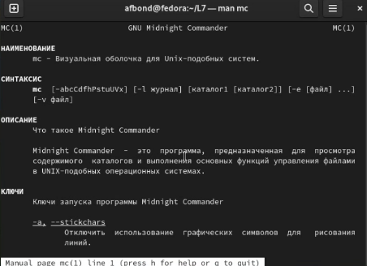

2. Запустил из командной строки mc, введя mc, изучаю его структуру и меню.

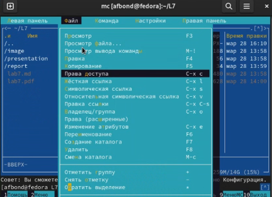

3. Выполнил несколько операций в mc, используя управляющие клавиши (операции с панелями; выделение/отмена выделения файлов, копирование/перемещение файлов, получение информации о размере и правах доступа на файлы и/или каталоги и т.п.)
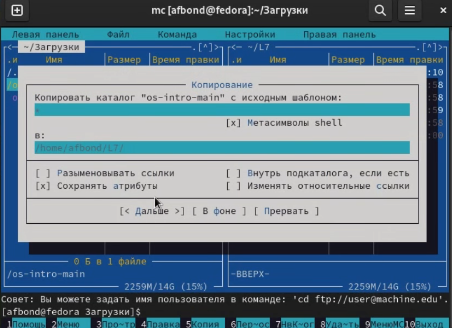

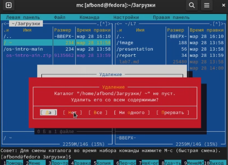

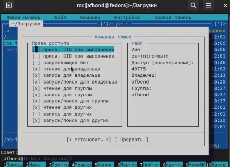

4. Выполнил основные команды меню левой панели. Попробовал все пункты из меню, в том числе основные: быстрый просмотр, общая информация, фильтр, выбор кодировки и т.д.


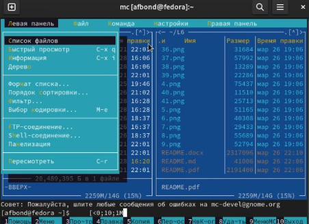

5. Используя возможности подменю Файл , посмотрел содержимое случайного файла, отредактировал содержимое случайного текстового файла без сохранения изменений(Ссылка: Рис.7). Создал каталог и скопировал туда файлы. (Ссылка: Рис.8)

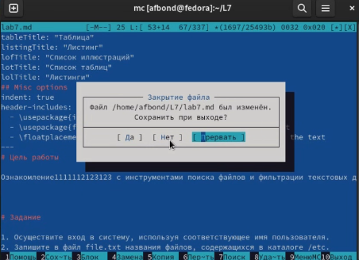

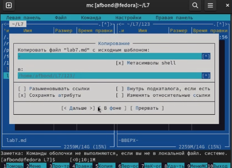

6. С помощью соответствующих средств mc осуществляю поиск файлов формата .с . (Ссылка: Рис. 9)

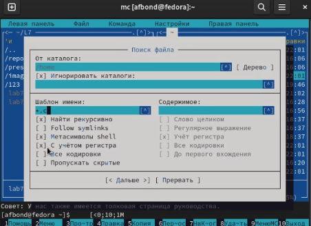

С помощью функции истории команд повторяю одну из ранее выполненных команд (Ссылка: Рис. 10) . Также осуществил переход в домашний каталог и проанализировал меню файла расширений.

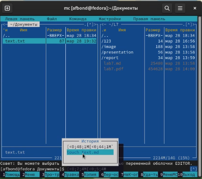


7. Вызвал подменю Настройки. Осваиваю операции, определяющие структуру экрана mс.

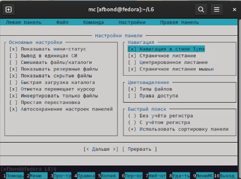

1. Создаю новый текстовой файл text.txt.
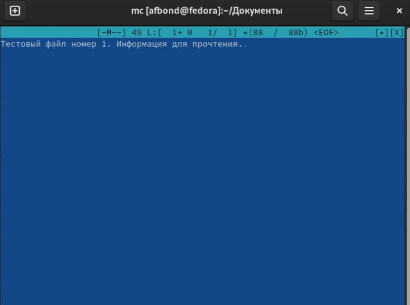


Вставил в открытый файл небольшой фрагмент текста, скопированный из другого источника. 

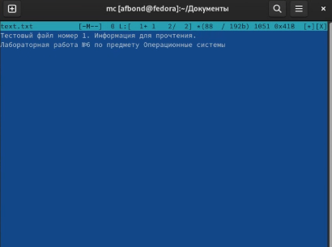

Проделал с текстом следующие манипуляции, используя горячие клавиши:
 Удалил строку текста с помощью F8.

Выделил фрагмент текста и скопировал его на новую строку с помощью F5.

Выделил фрагмент текста и перенес его на новую строку c помощью Ctrl+u и Shift+Ins.

Сохранил файл с помощью F2.

Отменил последнее действие с помощью Ctrl + U.

Перешел в конец файла с помощью Ctrl+End и напимал некоторый текст.

Перешел в начало файла с помощью Ctrl+Home и написал некоторый текст.

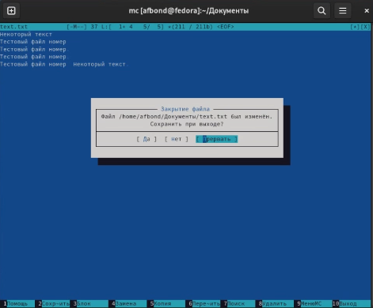

Сохранил и закрыл файл.

Открыл файл с исходным текстом с помощью gedit.


Используя меню редактора, включил подсветку синтаксиса.


```
```


```
```

# Выводы

Таким образом, мы освоили основные возможности командной оболочки Midnight Commander. Приобрели навыки практической работы по просмотру каталогов и файлов, манипуляций с ними. Научились создавать и удалять файлы, а также изменять их с помощью горячих клавиш.

# Ответы на контрольные вопросы

1. Какие режимы работы есть в mc. Охарактеризуйте их.

Midnight Commander имеет два основных режима работы:

Командный режим: в этом режиме вы можете использовать mc как файловый менеджер и выполнить различные действия над файлами и каталогами, такие как копирование, перемещение, удаление, переименование, создание, изменение прав доступа и т.д. Для этого используются различные клавиши, например, F5 - копировать, F6 - переместить, F8 - удалить, F9 - создать каталог, F4 - редактировать файл и т.д.

Режим редактирования: в этом режиме вы можете создавать и редактировать текстовые файлы. Для входа в этот режим необходимо выделить файл и нажать клавишу F4 или выбрать опцию "Редактировать" в верхней части экрана. В этом режиме вы можете использовать различные функции, такие как поиск, замена, копирование и вставка текста, а также изменение кодировки и перевода строк.

Кроме того, в mc есть ряд дополнительных режимов работы, которые можно настроить в соответствии с индивидуальными потребностями и предпочтениями пользователя:

Режим FTP: позволяет подключаться к удаленному серверу через протокол FTP и работать с файлами и каталогами на этом сервере, как если бы они были локальными.

Режим терминала: позволяет работать с командной строкой внутри mc, что может быть удобно для выполнения различных задач, таких как управление файлами, настройка системы и т.д.

Режим сравнения файлов: позволяет сравнивать содержимое двух файлов и выявлять различия между ними.

Режим пакетной обработки файлов: позволяет выполнять однотипные действия с несколькими файлами или каталогами одновременно.

Режим архивации: позволяет создавать и распаковывать архивы различных форматов (tar, gz, zip и т.д.)

2. Какие операции с файлами можно выполнить как с помощью команд shell, так и с помощью меню (комбинаций клавиш) mc? Приведите несколько примеров.

В Midnight Commander можно выполнить множество операций как с помощью команд shell, так и с помощью меню или комбинаций клавиш. Ниже приведены несколько примеров:

Копирование файла: в командной строке можно выполнить команду "cp <source_file> <destination_file>", а в mc - нажать клавишу F5, выделить файл и выбрать опцию "Копировать" в меню.

Перемещение файла: в командной строке можно выполнить команду "mv <source_file> <destination_file>", а в mc - нажать клавишу F6, выделить файл и выбрать опцию "Переместить" в меню.

Удаление файла: в командной строке можно выполнить команду "rm <file>", а в mc - нажать клавишу F8, выделить файл и выбрать опцию "Удалить" в меню.

Создание нового файла: в командной строке можно выполнить команду "touch <file>", а в mc - нажать клавишу F4, ввести имя файла и выбрать опцию "Создать" в меню.

Изменение прав доступа к файлу: в командной строке можно выполнить команду "chmod <permissions> <file>", а в mc - нажать клавишу F9, выделить файл и выбрать опцию "Свойства" в меню, затем изменить права доступа в соответствующем поле.

Просмотр содержимого файла: в командной строке можно выполнить команду "cat <file>", а в mc - нажать клавишу F3 или дважды щелкнуть на файле для просмотра его содержимого.

Это только некоторые примеры операций, которые можно выполнить как с помощью команд shell, так и с помощью меню или комбинаций клавиш в Midnight Commander.

3. Опишите структуру меню левой (или правой) панели mc, дайте характеристику командам.

Перейти в строку меню панелей mc можно с помощью функциональной клавиши F9 . В строке меню имеются пять меню: Левая панель , Файл , Команда , Настройки
и Правая панель .
Подпункт меню Быстрый просмотр позволяет выполнить быстрый просмотр содержимого панели.
Подпункт меню Информация позволяет посмотреть информацию о файле или
каталоге.
В меню каждой (левой или правой) панели можно выбрать формат списка :
– стандартный — выводит список файлов и каталогов с указанием размера и времени правки;
– ускоренный — позволяет задать число столбцов, на которые разбивается панель при выводе списка имён файлов или каталогов без дополнительной информации;
– расширенный — помимо названия файла или каталога выводит сведения о правах доступа, владельце, группе, размере, времени правки;
– определённый пользователем — позволяет вывести те сведения о файле или каталоге, которые задаст сам пользователь.
Подпункт меню Порядок сортировки позволяет задать критерии сортировки при
выводе списка файлов и каталогов: без сортировки, по имени, расширенный, время правки, время доступа, время изменения атрибута, размер, узел

4. Опишите структура меню Файл mc, дайте характеристику командам.

В меню Файл содержит перечень команд, которые могут быть применены к одному или нескольким файлам или каталогам. 
  
– Просмотр ( F3 ) — позволяет посмотреть содержимое текущего (или выделенного) файла без возможности редактирования.
  
– Просмотр вывода команды ( М + ! ) — функция запроса команды с параметрами (аргумент к текущему выбранному файлу).
  
– Правка ( F4 ) — открывает текущий (или выделенный) файл для его редактирования.
  
– Копирование ( F5 ) — осуществляет копирование одного или нескольких файлов или каталогов в указанное пользователем во всплывающем окне место.
  
– Права доступа ( Ctrl-x c ) — позволяет указать (изменить) права доступа к одному или нескольким файлам или каталогам.
  
– Жёсткая ссылка ( Ctrl-x l ) — позволяет создать жёсткую ссылку к текущему
(или выделенному) файлу
  
– Символическая ссылка ( Ctrl-x s ) — позволяет создать символическую ссылку
к текущему (или выделенному) файлу
  
– Владелец/группа ( Ctrl-x o ) — позволяет задать (изменить) владельца и имя группы для одного или нескольких файлов или каталогов.
  
– Права (расширенные) — позволяет изменить права доступа и владения для одного или нескольких файлов или каталогов.
  
– Переименование ( F6 ) — позволяет переименовать (или переместить) один или несколько файлов или каталогов.
  
– Создание каталога ( F7 ) — позволяет создать каталог.
  
– Удалить ( F8 ) — позволяет удалить один или несколько файлов или каталогов.
  
– Выход ( F10 ) — завершает работу mc.


5. Опишите структуру меню Команда mc, дайте характеристику командам.

В меню Команда содержатся более общие команды для работы с mc 
Команды меню Команда :
  
– Дерево каталогов — отображает структуру каталогов системы.
  
– Поиск файла — выполняет поиск файлов по заданным параметрам.
  
– Переставить панели — меняет местами левую и правую панели.
  
– Сравнить каталоги ( Ctrl-x d ) — сравнивает содержимое двух каталогов.
  
– Размеры каталогов — отображает размер и время изменения каталога (по умолчанию в mc размер каталога корректно не отображается).
  
– История командной строки — выводит на экран список ранее выполненных в оболочке команд.
  
– Каталоги быстрого доступа ( Ctrl-\ ) — пр вызове выполняется быстрая смена текущего каталога на один из заданного списка.
  
– Восстановление файлов — позволяет восстановить файлы на файловых системах ext2 и ext3.
  
– Редактировать файл расширений — позволяет задать с помощью определённого синтаксиса действия при запуске файлов с определённым расширением (например, какое программного обеспечение запускать для открытия или редактирования файлов с расширением doc или docx).
  
– Редактировать файл меню — позволяет отредактировать контекстное меню пользователя, вызываемое по клавише F2 .
  
– Редактировать файл расцветки имён — позволяет подобрать оптимальную для пользователя расцветку имён файлов в зависимости от их типа.

6. Опишите структуру меню Настройки mc, дайте характеристику командам.

Меню Настройки содержит ряд дополнительных опций по внешнему виду и
функциональности mc.
  
Меню Настройки содержит:
  
– Конфигурация — позволяет скорректировать настройки работы с панелями.
  
– Внешний вид и Настройки панелей — определяет элементы (строка меню, командная строка, подсказки и прочее), отображаемые при вызове mc, а также геометрию расположения панелей и цветовыделение.
  
– Биты символов — задаёт формат обработки информации локальным терминалом.
  
– Подтверждение — позволяет установить или убрать вывод окна с запросом подтверждения действий при операциях удаления и перезаписи файлов, а также при выходе из программы.
  
– Распознание клавиш — диалоговое окно используется для тестирования функциональных клавиш, клавиш управления курсором и прочее.
  
– Виртуальные ФС –– настройки виртуальной файловой системы: тайм-аут, пароль
и прочее.


7. Назовите и дайте характеристику встроенным командам mc.

Работа с панелями
  
Ctrl + R - обновить активную панель
  
Ctrl + \ - справочник каталогов быстрого доступа
  
Ctrl + S или M + S- поиск файлов в текущем каталоге по начальным символам
  
Ctrl + X H - добавить текущий каталог в справочник каталогов быстрого доступа
  
M + G - перейти на первый файл или каталог в видимом списке на панели
  
M + J - перейти на последний файл или каталог в видимом списке на панели
  
M + R - перейти на средний файл или каталог в видимом списке на панели
  
M + O - неактивная панель = активная панель
  
M + . - показывать/скрыть скрытые файлы и каталоги
  
M + T - cменить вид панели (стандартный, укороченный, расширенный)
  
+ (Plus) - вызвать окно для выделения группы файлов (можно использовать регулярные выражения)
  
\ (Backslash) - снять выделение с группы файлов (действие, обратное тому, которое вызывается по клавише "+").
  
Работа с файлами
  
Shift + F4 - открыть редактор на изменение нового файла, при сохранении будет запрошено его имя
  
Shift + F5 - копирование файла в тот же каталог
  
Shift + F6 - инлайн-переименование текущего файла
  
Ctrl + X C - посмотреть/поменять права (chmod) для отмеченных файлов
  
Ctrl + X I - быстрый просмотр информации о текущем объекте на второй панели
  
Ctrl + X O - посмотреть/поменять владельца (chown) для отмеченных файлов
  
Ctrl + X Q - быстрый просмотр содержимого файла на второй панели
  
Ctrl + X S - создать символическую ссылку (symlink)
  
Работа с командной строкой
  
M + Enter - вставляет в командную строку имя файла, на котором находится курсор
  
M + P - показывает в командной строке предыдущую команду
  
M + N - показывает в командной строке следующую команду
  
M + <TAB> или Esc + <TAB> - автодополнение команды, если вариантов несколько - то повторное нажатие высвечивает список возможных вариантов
  
Ctrl + X P или M + A - вставить в командную строку путь текущей панели
  
Ctrl + X T - вставить в командную строку выделенные объекты
  

8. Назовите и дайте характеристику командам встроенного редактора mc.

Встроенный в mc редактор вызывается с помощью функциональной клавиши F4 . 
В нём удобно использовать различные комбинации клавиш при редактировании содержимого (как правило текстового) файла.
  
Клавиши для редактирования файла:
  
Ctrl-y удалить строку
  
Ctrl-u отмена последней операции
  
Ins вставка/замена
  
F7 поиск (можно использовать регулярные выражения)
  
-F7 повтор последней операции поиска
  
F4 замена
  
F3 первое нажатие — начало выделения, второе — окончание выделения
  
F5 копировать выделенный фрагмент
  
F6 переместить выделенный фрагмент
  
F8 удалить выделенный фрагмент
  
F2 записать изменения в файл
  
F10 выйти из редактора

9. Дайте характеристику средствам mc, которые позволяют создавать меню, определяемые пользователем.

Midnight Commander предоставляет возможность создавать пользовательские меню, которые могут содержать произвольные команды и выполнять любые операции.

Для создания пользовательского меню в mc необходимо выполнить следующие действия:

Открыть файл ~/.config/mc/menu. Этот файл содержит список всех пользовательских меню.

Добавить новый блок в файле, определяющий пользовательское меню. Каждый блок должен начинаться с имени меню в квадратных скобках, например:
```
[My Custom Menu]
``` 
Добавить команды в блок. Каждая команда должна быть записана в отдельной строке и начинаться с символа "|", например:
```
|cat myfile.txt
```
Сохранить изменения и закрыть файл.
  
Пользовательские меню в mc очень гибкие и могут выполнять любые операции, которые поддерживаются командами shell. Они могут содержать произвольные команды, включая команды для работы с файлами и каталогами, сетевыми командами, команды для управления системой и др.

10. Дайте характеристику средствам mc, которые позволяю

Midnight Commander позволяет определять пользовательские действия, которые могут быть выполнены над текущим файлом или набором файлов. Действия могут быть определены с помощью встроенного языка обработки файлов mc (или любого другого скриптового языка, такого как Bash), и затем добавлены в меню "Действия" в mc.

Чтобы добавить пользовательское действие в mc, необходимо выполнить следующие действия:

Определить действие с помощью скрипта. Это может быть любой скрипт, написанный на любом языке программирования, который может принимать текущий файл или список файлов в качестве аргумента.

Создать файл, содержащий определение действия. Файл должен начинаться с комментария, в котором указывается название действия и его описание, например:

 ``` 
# action: My Custom Action
# description: This is my custom action
 ``` 
Вставить скрипт в файл после комментариев.

Сохранить файл с именем, соответствующим названию действия. Например, если действие называется "My Custom Action", файл должен называться "My Custom Action.sh".

Переместить файл в каталог "~/.local/share/mc/usermenu". Если каталог не существует, его нужно создать.

Запустить mc и открыть меню "Действия". Пользовательское действие будет отображаться в меню.

Пользовательские действия в mc могут выполнять любые операции, которые поддерживаются скриптами и командами shell. Они могут обрабатывать один или несколько файлов, включая возможность перезаписи или изменения файлов.

