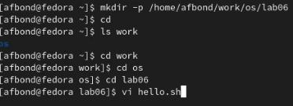
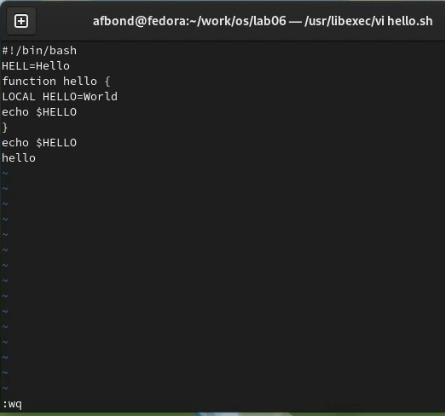
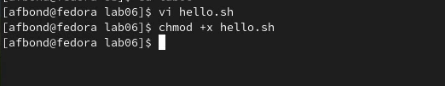
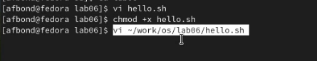

---
## Front matter
title: "Лабораторная работа №9 по предмету Операционные системы"
subtitle: "Группа НПМбв-01-19"
author: "Бондаренко Артем Федорович"

## Generic otions
lang: ru-RU
toc-title: "Содержание"

## Bibliography
bibliography: bib/cite.bib
csl: pandoc/csl/gost-r-7-0-5-2008-numeric.csl

## Pdf output format
toc: true # Table of contents
toc-depth: 2
lof: true # List of figures
lot: true # List of tables
fontsize: 12pt
linestretch: 1.5
papersize: a4
documentclass: scrreprt
## I18n polyglossia
polyglossia-lang:
  name: russian
polyglossia-otherlangs:
  name: english
## I18n babel
babel-lang: russian
babel-otherlangs: english
## Fonts
mainfont: PT Serif
romanfont: PT Serif
sansfont: PT Sans
monofont: PT Mono
mainfontoptions: Ligatures=TeX
romanfontoptions: Ligatures=TeX
sansfontoptions: Ligatures=TeX,Scale=MatchLowercase
monofontoptions: Scale=MatchLowercase,Scale=0.9
## Biblatex
biblatex: true
biblio-style: "gost-numeric"
biblatexoptions:
  - parentracker=true
  - backend=biber
  - hyperref=auto
  - language=auto
  - autolang=other*
  - citestyle=gost-numeric
## Pandoc-crossref LaTeX customization
figureTitle: "Рис."
tableTitle: "Таблица"
listingTitle: "Листинг"
lofTitle: "Список иллюстраций"
lotTitle: "Список таблиц"
lolTitle: "Листинги"
## Misc options
indent: true
header-includes:
  - \usepackage{indentfirst}
  - \usepackage{float} # keep figures where there are in the text
  - \floatplacement{figure}{H} # keep figures where there are in the text
---
# Цель работы

Познакомиться с операционной системой Linux. Получить практические навыки работы с редактором vi, установленным по умолчанию практически во всех дистрибутивах.


# Задание

**Задание 1. Создание нового файла с использованием vi**

1. Создайте каталог с именем ~/work/os/lab06.

2. Перейдите во вновь созданный каталог.

3. Вызовите vi и создайте файл hello.sh 

vi hello.sh

4. Нажмите клавишу i и вводите следующий текст.
```
#!/bin/bash

HELL=Hello

function hello {

LOCAL HELLO=World

echo $HELLO

}

echo $HELLO

hello
```
5. Нажмите клавишу Esc для перехода в командный режим после завершения ввода текста.

6. Нажмите : для перехода в режим последней строки и внизу вашего экрана появится приглашение в виде двоеточия.

7. Нажмите w (записать) и q (выйти), а затем нажмите клавишу Enter для сохранения вашего текста и завершения работы.

8. Сделайте файл исполняемым

chmod +x hello.sh

**Задание 2. Редактирование существующего файла**

1. Вызовите vi на редактирование файла

vi ~/work/os/lab06/hello.sh

2. Установите курсор в конец слова HELL второй строки.

3. Перейдите в режим вставки и замените на HELLO. Нажмите Esc для возврата в командный режим.

4. Установите курсор на четвертую строку и сотрите слово LOCAL.

5. Перейдите в режим вставки и наберите следующий текст: local, нажмите Esc для возврата в командный режим.

6. Установите курсор на последней строке файла. Вставьте после неё строку, содержащую следующий текст: echo $HELLO.

7. Нажмите Esc для перехода в командный режим.

8. Удалите последнюю строку.

9. Введите команду отмены изменений u для отмены последней команды.

10. Введите символ : для перехода в режим последней строки. Запишите произведённые изменения и выйдите из vi.


# Выполнение лабораторной работы

Для начала открыт терминал и создал каталог с именем ~/work/os/lab06. После с помощью команды cd перешёл во вновь созданный каталог.
Вызвал vi и создал файл hello.sh. (Ссылка: Рис.1) 




После открытия созданного файла в редакторе vi нажал клавишу i и ввёл следующий текст:

```
#!/bin/bash

HELL=Hello

function hello {

LOCAL HELLO=World

echo $HELLO

}

echo $HELLO

hello
```

Нажал клавишу Esc для перехода в командный режим после завершения ввода текста и shift + : для перехода в режим последней строки, в которой набрал w для сохранения  внесенных изменений и q для выхода. (Ссылка: Рис. 2). Нажал Enter. 





Далее сделал файл исполняемым, введя команду: chmod +x hello.sh. (Ссылка: Рис 3.)




Перехожу ко второй части задания.

Вызвал vi для редактирование необходимого файла путем ввода команды vi ~/work/os/lab06/hello.sh (Ссылка: Рис. 4) 




После открытия файла установил курсор в конец слова HELL второй строки, затем перешел в режим вставки и заменил на HELLO. Нажал Esc для возврата в командный режим
Установил курсор на четвертую строку и стер слово LOCAL и перешёл в режим вставки и ввёл слово local.

В режиме вставки установил курсор на последней строке файла и вставил после неё строку, содержащую следующий текст: echo $HELLO. Далее перешёл в командный режим и удали последнюю строчку. После чего ввёл команду отмены изменений u для отмены последней команды. 

После чего нажал shift + : для перехода в режим последней строки, в которой набрал w для сохранения внесенных изменений и q для выхода из vi.

```
```

# Выводы

Таким образом, мы познакомились с операционной системой Linux и интерактивным экранным редактором vi (Visual display editor), который большинстве дистрибутивов Linux в качестве текстового редактора установлен по умолчанию. В процессе работы получили практические навыки работы с редактором vi, освоили основные функции этого редактора, получили знания о том, как удалять, копировать, добавлять, редактировать и сохранять внесённые изменения в редакторе vi.

# Ответы на контрольные вопросы

1. Дайте краткую характеристику режимам работы редактора vi.

Редактор vi имеет три режима работы:
– командный режим — предназначен для ввода команд редактирования и навигации по редактируемому файлу;
– режим вставки — предназначен для ввода содержания редактируемого файла;
– режим последней (или командной) строки — используется для записи изменений в файл и выхода из редактора.


2. Как выйти из редактора, не сохраняя произведённые изменения?

Если требуется выйти из редактора без сохранения, то нужно набрать символ q (или q!)

3. Назовите и дайте краткую характеристику командам позиционирования.

Команды позиционирования

– 0 (ноль) — переход в начало строки;

– $ — переход в конец строки;

– G — переход в конец файла;

– n G — переход на строку с номером n

4. Что для редактора vi является словом?


5. Каким образом из любого места редактируемого файла перейти в начало (конец) файла?

– G — переход в конец файла;

6. Назовите и дайте краткую характеристику основным группам команд редактирования.
 
 Команды редактирования

Вставка текста

– а — вставить текст после курсора;

– А — вставить текст в конец строки;

– i — вставить текст перед курсором;

– n i — вставить текст n раз;

– I — вставить текст в начало строки.

Вставка строки

– о — вставить строку под курсором;

– О — вставить строку над курсором.

Удаление текста

– x — удалить один символ в буфер;

– d w — удалить одно слово в буфер;

– d $ — удалить в буфер текст от курсора до конца строки;

– d 0 — удалить в буфер текст от начала строки до позиции курсора;

– d d — удалить в буфер одну строку;

– n d d — удалить в буфер n строк.

Отмена и повтор произведённых изменений

– u — отменить последнее изменение;

– . — повторить последнее изменение.

Копирование текста в буфер

– Y — скопировать строку в буфер;

– n Y — скопировать n строк в буфер;

– y w — скопировать слово в буфер.

Вставка текста из буфера

– p — вставить текст из буфера после курсора;

– P — вставить текст из буфера перед курсором.

Замена текста

– c w — заменить слово;

– n c w — заменить n слов;

– c $ — заменить текст от курсора до конца строки;

– r — заменить слово;

– R — заменить текст.

Поиск текста

– / текст — произвести поиск вперёд по тексту указанной строки символов текст;

– ? текст — произвести поиск назад по тексту указанной строки символов текст.


7. Необходимо заполнить строку символами $. Каковы ваши действия?


8. Как отменить некорректное действие, связанное с процессом редактирования?

– u — отменить последнее изменение;

9. Назовите и дайте характеристику основным группам команд режима последней строки.

– : w — записать изменённый текст в файл, не выходя из vi;

– : w имя-файла — записать изменённый текст в новый файл с именем имяфайла;

– : w ! имя-файла — записать изменённый текст в файл с именем имяфайла;

– : w q — записать изменения в файл и выйти из vi;

– : q — выйти из редактора vi;

– : q ! — выйти из редактора без записи;

– : e ! — вернуться в командный режим, отменив все изменения, произведённые со времени последней записи.


10. Как определить, не перемещая курсора, позицию, в которой заканчивается строка?


11. Выполните анализ опций редактора vi (сколько их, как узнать их назначение и т.д.).


12. Как определить режим работы редактора vi?

Это можно определенить по осведомительным текстовым сообщениям редактора внизу окна взаимодействия с редактором.

13. Постройте граф взаимосвязи режимов работы редактора vi.

