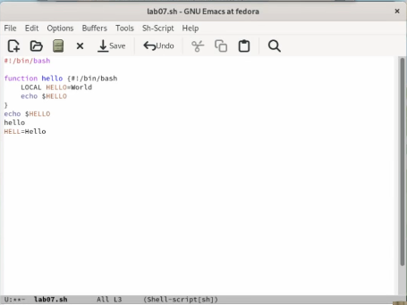
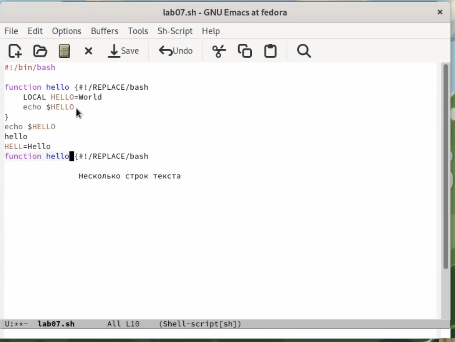
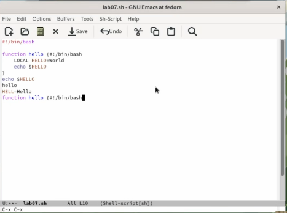
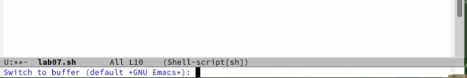
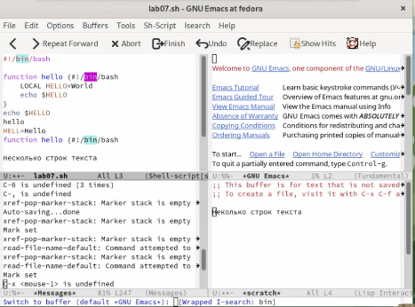
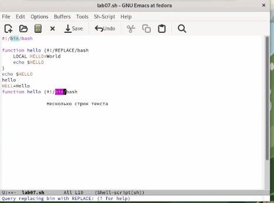
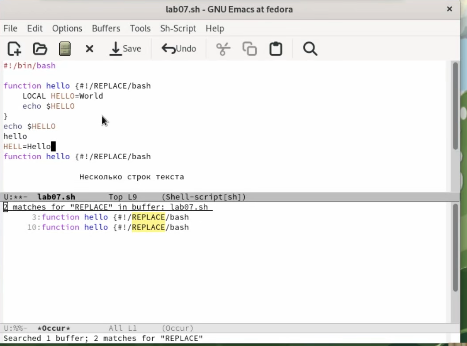

---
## Front matter
title: "Лабораторная работа №10 по предмету Операционные системы"
subtitle: "Группа НПМбв-01-19"
author: "Бондаренко Артем Федорович"

## Generic otions
lang: ru-RU
toc-title: "Содержание"

## Bibliography
bibliography: bib/cite.bib
csl: pandoc/csl/gost-r-7-0-5-2008-numeric.csl

## Pdf output format
toc: true # Table of contents
toc-depth: 2
lof: true # List of figures
lot: true # List of tables
fontsize: 12pt
linestretch: 1.5
papersize: a4
documentclass: scrreprt
## I18n polyglossia
polyglossia-lang:
  name: russian
polyglossia-otherlangs:
  name: english
## I18n babel
babel-lang: russian
babel-otherlangs: english
## Fonts
mainfont: PT Serif
romanfont: PT Serif
sansfont: PT Sans
monofont: PT Mono
mainfontoptions: Ligatures=TeX
romanfontoptions: Ligatures=TeX
sansfontoptions: Ligatures=TeX,Scale=MatchLowercase
monofontoptions: Scale=MatchLowercase,Scale=0.9
## Biblatex
biblatex: true
biblio-style: "gost-numeric"
biblatexoptions:
  - parentracker=true
  - backend=biber
  - hyperref=auto
  - language=auto
  - autolang=other*
  - citestyle=gost-numeric
## Pandoc-crossref LaTeX customization
figureTitle: "Рис."
tableTitle: "Таблица"
listingTitle: "Листинг"
lofTitle: "Список иллюстраций"
lotTitle: "Список таблиц"
lolTitle: "Листинги"
## Misc options
indent: true
header-includes:
  - \usepackage{indentfirst}
  - \usepackage{float} # keep figures where there are in the text
  - \floatplacement{figure}{H} # keep figures where there are in the text
---
# Цель работы

Познакомиться с операционной системой Linux. Получить практические навыки работы с редактором Emacs.


# Задание

**Последовательность выполнения работы**

1. Ознакомиться с теоретическим материалом.

2. Ознакомиться с редактором emacs.

3. Выполнить упражнения.

4. Ответить на контрольные вопросы.

**Основные команды emacs**

1. Открыть emacs.

2. Создать файл lab07.sh с помощью комбинации Ctrl-x Ctrl-f (C-x C-f).

3. Наберите текст:
```
#!/bin/bash
HELL=Hello
function hello {
50 Лабораторная работа № 7. Текстовой редактор emacs
LOCAL HELLO=World
echo $HELLO
}
echo $HELLO
hello
```
4. Сохранить файл с помощью комбинации Ctrl-x Ctrl-s (C-x C-s).

5. Проделать с текстом стандартные процедуры редактирования, каждое действие должно осуществляться комбинацией клавиш.

5.1. Вырезать одной командой целую строку (С-k).

5.2. Вставить эту строку в конец файла (C-y).

5.3. Выделить область текста (C-space).

5.4. Скопировать область в буфер обмена (M-w).

5.5. Вставить область в конец файла.

5.6. Вновь выделить эту область и на этот раз вырезать её (C-w).

5.7. Отмените последнее действие (C-/).

6. Научитесь использовать команды по перемещению курсора.

6.1. Переместите курсор в начало строки (C-a).

6.2. Переместите курсор в конец строки (C-e).

6.3. Переместите курсор в начало буфера (M-<).

6.4. Переместите курсор в конец буфера (M->).

7. Управление буферами.

7.1. Вывести список активных буферов на экран (C-x C-b).

7.2. Переместитесь во вновь открытое окно (C-x) o со списком открытых буферов и переключитесь на другой буфер.

7.3. Закройте это окно (C-x 0).

7.4. Теперь вновь переключайтесь между буферами, но уже без вывода их списка на экран (C-x b).

8. Управление окнами.

8.1. Поделите фрейм на 4 части: разделите фрейм на два окна по вертикали (C-x 3), а затем каждое из этих окон на две части по горизонтали (C-x 2)

8.2. В каждом из четырёх созданных окон откройте новый буфер (файл) и введите несколько строк текста.

9. Режим поиска

9.1. Переключитесь в режим поиска (C-s) и найдите несколько слов, присутствующих в тексте.

9.2. Переключайтесь между результатами поиска, нажимая C-s.

9.3. Выйдите из режима поиска, нажав C-g.

9.4. Перейдите в режим поиска и замены (M-%), введите текст, который следует найти и заменить, нажмите Enter , затем введите текст для замены. После того как будут подсвечены результаты поиска, нажмите ! для подтверждения
замены.

9.5. Испробуйте другой режим поиска, нажав M-s o. Объясните, чем он отличается от обычного режима?


# Выполнение лабораторной работы

Загрузил и открыл emacs через терминал.

Создал файл lab07.sh с помощью комбинации Ctrl-x Ctrl-f (C-x C-f) и набрал следующий текст:
```
#!/bin/bash
HELL=Hello
function hello {
50 Лабораторная работа № 7. Текстовой редактор emacs
LOCAL HELLO=World
echo $HELLO
}
echo $HELLO
hello
```
Сохранил файл с помощью комбинации Ctrl-x Ctrl-s (C-x C-s). (Ссылка: Рис.1)


Рис. 1: Введенный текст сохранен, в созданном файле lab07.sh


Далее проделал с текстом стандартные процедуры редактирования, каждое действие осуществлял комбинацией клавиш.

Вырезал одной командой целую строку (С-k). И вставил эту строку в конец файла (C-y). (Ссылка: Рис.2)



Рис. 2: Строка в конце файла


Выделил область текста (C-space), определяя необходимое количество текста с помощью стрелок на клавиатуре.

Скопировать область в буфер обмена (M-w).

Вставил выделенную область в конец файла. (Ссылка: Рис.3)



Рис. 3: Выделенная область в конце файла

Далее вновь выделить эту область и на этот раз вырезал её с помощью комбинации клавиш (C-w). Далее отменил последнее действие (C-/).


Далее учусь использовать команды по перемещению курсора.

Переместил курсор в начало строки (C-a). Затем переместил курсор в конец строки (C-e).

Переместил курсор в начало буфера зажав (M-<), а также с помощью зажатия (Alt-b).

Переместил курсор в конец буфера (M->), а также с помощью зажатия(Alt-c). (Ссылка: Рис.4)



Рис. 4: Конечное положение курсора в конце буфера файла

Далее учусь управлять буферами файла.

Вывел список активных буферов на экран (C-x C-b).

Переместился во вновь открытое окно (C-x) со списком открытых буферов и переключился на другой буфер. (Ссылка: Рис.5)


Рис. 5: Список открытых буферов


Закрыл это окно (C-x 0).

Теперь вновь переключился между буферами, но уже без вывода их списка на экран (C-x b). (Ссылка: Рис.6)




Рис. 6: Интерфейс переключения на другой буфер без вывода списка на экран 


Далее учусь управлять окнами.

Поделил фрейм на 4 части: разделил фрейм на два окна по вертикали (C-x 3), а затем каждое из этих окон на две части по горизонтали (C-x 2)

В каждом из четырёх созданных окон открыл новый буфер (файл) и ввёл несколько строк текста. (Ссылка: Рис.7)


Рис. 7: Фрейм разделенный на 4 части, а также введённый текст “Несколько строк текста” в этих буферах


Изучение режима поиска

Переключился в режим поиска (C-s) и нашёл несколько слов, присутствующих в тексте, а именно bin.

Переключился между результатами поиска, нажимая C-s. (Ссылка: Рис.8)

 

Рис. 8: Процесс переключения между результатами поиска

Вышел из режима поиска, нажав C-g.
Перейдите в режим поиска и замены (M-%), ввел текст bin, который планирую найти и заменить на REPLACE, нажал Enter, а затем ввёл текст для замены.

После того как результаты поиска были подсвечены, нажал ! для подтверждения замены. (Ссылка: Рис.9)



Рис. 9: Результат замены

Испробовал другой режим поиска, нажав (M-s o). Он выгодно отличается от обычного режима если требуется найти что-то в очень большом объеме текста, так как предоставляет информацию о искомом тексте сразу с номером строки, следовательно не требует рассматривать результаты, переходя на каждую строку в отдельности в отличие от обычного режима. (Ссылка: Рис.10)




Рис. 10: Интерфейс другого режима поиска

```
```

# Выводы

Таким образом, мы познакомились  с операционной системой Linux, а также получили практические навыки работы с редактором Emacs. Научились проделывать стандартные процедуры редактирования, использовать команды по перемещению курсора, управлять буферами, управлять окнами в редакторе emacs.


# Ответы на контрольные вопросы

1. Кратко охарактеризуйте редактор emacs.

Emacs представляет собой мощный экранный редактор текста, написанный на
языке высокого уровня Elisp.

2. Какие особенности данного редактора могут сделать его сложным для освоения новичком?

Emacs предлагает широкий спектр клавиатурных команд, которые могут заменить использование мыши. Некоторые из этих команд не очевидны, и новичку может быть сложно запомнить и использовать их на первых порах. в Emacs также используется система буферов, которая может показаться непривычной для новичков. Концепция буферов позволяет одновременно работать с несколькими файлами, но может быть сложной для понимания и управления.

3. Своими словами опишите, что такое буфер и окно в терминологии emacs’а.

Интерфейс в котором происходит практически всё взаимодействие пользователя с редактором emacs.

4. Можно ли открыть больше 10 буферов в одном окне?

Да, в Emacs можно открыть больше 10 буферов в одном окне. По умолчанию в Emacs имеется ограничение на количество буферов, которые можно открыть в одном окне, которое составляет 10.

5. Какие буферы создаются по умолчанию при запуске emacs?

Буфер scratch: Этот буфер создается автоматически при запуске Emacs и используется для временного хранения информации, которую вы можете использовать для тестирования кода или для заметок.

Буфер Messages: Этот буфер также создается автоматически и используется для вывода сообщений о состоянии Emacs и его действиях, например, сообщений об ошибках.

Буфер GNU Emacs: Этот буфер содержит информацию о версии Emacs и некоторые базовые команды для начала работы с редактором.

Буфер Help: Этот буфер содержит руководства по использованию Emacs и его команд.

Буфер Buffer List: Этот буфер содержит список всех открытых буферов в Emacs.

6. Какие клавиши вы нажмёте, чтобы ввести следующую комбинацию C-c | и C-c C-|?

Cntrl + c. Cntrl + c и Cntrl + pipe.

7. Как поделить текущее окно на две части?

 (C-x 2)

8. В каком файле хранятся настройки редактора emacs?

~/.emacs или ~/.emacs.d/init.el: Это файл настроек Emacs, который запускается при каждом запуске редактора. В нем можно определить настройки для пакетов, изменить ключевые комбинации клавиш, установить переменные среды и другие настройки.

9. Какую функцию выполняет клавиша <- и можно ли её переназначить?

Клавиша "стрелка влево" в Emacs используется для перемещения курсора на один символ влево. Эта клавиша также может использоваться в комбинации с другими клавишами для перемещения курсора на разные расстояния, например, для выделения текста.

Да, можно, Emacs любую клавишу можно переназначить. 

10. Какой редактор вам показался удобнее в работе vi или emacs? Поясните почему

Редактор emacs показался удобнее, хотя оба редактора имеют необычное расположение горячих клавиш, например, для копирования текста, вставки текста, отмены последнего действия и так далее, тем не менее emasc показался более интуитивным, а также более функциональным чем vi.
