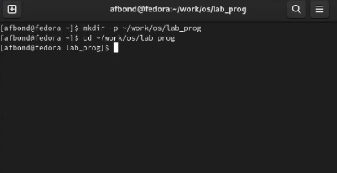

---
## Front matter
title: "Лабораторная работа №14 по предмету Операционные системы"
subtitle: "Группа НПМбв-01-19"
author: "Бондаренко Артем Федорович"

## Generic otions
lang: ru-RU
toc-title: "Содержание"

## Bibliography
bibliography: bib/cite.bib
csl: pandoc/csl/gost-r-7-0-5-2008-numeric.csl

## Pdf output format
toc: true # Table of contents
toc-depth: 2
lof: true # List of figures
lot: true # List of tables
fontsize: 12pt
linestretch: 1.5
papersize: a4
documentclass: scrreprt
## I18n polyglossia
polyglossia-lang:
  name: russian
polyglossia-otherlangs:
  name: english
## I18n babel
babel-lang: russian
babel-otherlangs: english
## Fonts
mainfont: PT Serif
romanfont: PT Serif
sansfont: PT Sans
monofont: PT Mono
mainfontoptions: Ligatures=TeX
romanfontoptions: Ligatures=TeX
sansfontoptions: Ligatures=TeX,Scale=MatchLowercase
monofontoptions: Scale=MatchLowercase,Scale=0.9
## Biblatex
biblatex: true
biblio-style: "gost-numeric"
biblatexoptions:
  - parentracker=true
  - backend=biber
  - hyperref=auto
  - language=auto
  - autolang=other*
  - citestyle=gost-numeric
## Pandoc-crossref LaTeX customization
figureTitle: "Рис."
tableTitle: "Таблица"
listingTitle: "Листинг"
lofTitle: "Список иллюстраций"
lotTitle: "Список таблиц"
lolTitle: "Листинги"
## Misc options
indent: true
header-includes:
  - \usepackage{indentfirst}
  - \usepackage{float} # keep figures where there are in the text
  - \floatplacement{figure}{H} # keep figures where there are in the text
---
# Цель работы

Приобрести простейшие навыки разработки, анализа, тестирования и отладки приложений в ОС типа UNIX/Linux на примере создания на языке программирования С калькулятора с простейшими функциями.


# Задание

1. В домашнем каталоге создайте подкаталог ~/work/os/lab_prog.

2. Создайте в нём файлы: calculate.h, calculate.c, main.c.
Это будет примитивнейший калькулятор, способный складывать, вычитать, умножать и делить, возводить число в степень, брать квадратный корень, вычислять sin, cos, tan. При запуске он будет запрашивать первое число, операцию, второе число. После этого программа выведет результат и остановится.

Реализация функций калькулятора в файле calculate.h:

```
////////////////////////////////////
// calculate.c
#include <stdio.h>
#include <math.h>
#include <string.h>
#include "calculate.h"
float
Calculate(float Numeral, char Operation[4])
{
float SecondNumeral;
if(strncmp(Operation, "+", 1) == 0)
{
printf("Второе слагаемое: ");
scanf("%f",&SecondNumeral);
return(Numeral + SecondNumeral);
}
else if(strncmp(Operation, "-", 1) == 0)
{
printf("Вычитаемое: ");
scanf("%f",&SecondNumeral);
return(Numeral - SecondNumeral);
}
else if(strncmp(Operation, "*", 1) == 0)
{
printf("Множитель: ");
scanf("%f",&SecondNumeral);
return(Numeral * SecondNumeral);
}
else if(strncmp(Operation, "/", 1) == 0)
{
printf("Делитель: ");
scanf("%f",&SecondNumeral);
if(SecondNumeral == 0)
{
printf("Ошибка: деление на ноль! ");
return(HUGE_VAL);
}
else
return(Numeral / SecondNumeral);
}
else if(strncmp(Operation, "pow", 3) == 0)
{
printf("Степень: ");
scanf("%f",&SecondNumeral);
return(pow(Numeral, SecondNumeral));
}
else if(strncmp(Operation, "sqrt", 4) == 0)
return(sqrt(Numeral));
else if(strncmp(Operation, "sin", 3) == 0)
return(sin(Numeral));
else if(strncmp(Operation, "cos", 3) == 0)
return(cos(Numeral));
else if(strncmp(Operation, "tan", 3) == 0)
return(tan(Numeral));
else
{
printf("Неправильно введено действие ");
return(HUGE_VAL);
}
}

```
Интерфейсный файл calculate.h, описывающий формат вызова функциикалькулятора:

```
///////////////////////////////////////
// calculate.h
#ifndef CALCULATE_H_
#define CALCULATE_H_
float Calculate(float Numeral, char Operation[4]);
#endif /*CALCULATE_H_*/

```
Основной файл main.c, реализующий интерфейс пользователя к калькулятору:

```
////////////////////////////////////////
// main.c
#include <stdio.h>
#include "calculate.h"
int
main (void)
{
float Numeral;
char Operation[4];
float Result;
printf("Число: ");
scanf("%f",&Numeral);
printf("Операция (+,-,*,/,pow,sqrt,sin,cos,tan): ");
scanf("%s",&Operation);
Result = Calculate(Numeral, Operation);
printf("%6.2f\n",Result);
return 0;
}

```
3. Выполните компиляцию программы посредством gcc:

```
gcc -c calculate.c
gcc -c main.c
gcc calculate.o main.o -o calcul -lm

```
4. При необходимости исправьте синтаксические ошибки.

5. Создайте Makefile со следующим содержанием:

```
#
# Makefile
#
CC = gcc
CFLAGS =
LIBS = -lm
calcul: calculate.o main.o
gcc calculate.o main.o -o calcul $(LIBS)
calculate.o: calculate.c calculate.h
gcc -c calculate.c $(CFLAGS)
main.o: main.c calculate.h
gcc -c main.c $(CFLAGS)
clean:
-rm calcul *.o *~
# End Makefile

```
Поясните в отчёте его содержание.

6. С помощью gdb выполните отладку программы calcul (перед использованием gdb исправьте Makefile):

– Запустите отладчик GDB, загрузив в него программу для отладки: 

```
gdb ./calcul
```

– Для запуска программы внутри отладчика введите команду run:

```
run

```
– Для постраничного (по 9 строк) просмотра исходного код используйте команду list:

```
list

```
– Для просмотра строк с 12 по 15 основного файла используйте list с параметрами:

```
list 12,15

```
– Для просмотра определённых строк не основного файла используйте list с параметрами:

```
list calculate.c:20,29

```
– Установите точку останова в файле calculate.c на строке номер 21:

```
list calculate.c:20,27
break 21

```
– Выведите информацию об имеющихся в проекте точка останова:

```
info breakpoints

```
– Запустите программу внутри отладчика и убедитесь, что программа остановится в момент прохождения точки останова:

```
run
5
-
backtrace

```
– Отладчик выдаст следующую информацию:

```
#0 Calculate (Numeral=5, Operation=0x7fffffffd280 "-")
at calculate.c:21
#1 0x0000000000400b2b in main () at main.c:17
78 Лабораторная работа № 11. Средства, применяемые при разработке программного…

```
а команда backtrace покажет весь стек вызываемых функций от начала программы до текущего места.

– Посмотрите, чему равно на этом этапе значение переменной Numeral, введя:

```
print Numeral

```
На экран должно быть выведено число 5.
– Сравните с результатом вывода на экран после использования команды:

```
display Numeral

```
– Уберите точки останова:

```
info breakpoints
delete 1

```
7. С помощью утилиты splint попробуйте проанализировать коды файлов calculate.c и main.c.


# Выполнение лабораторной работы

Описываются проведённые действия, в качестве иллюстрации даётся ссылка на иллюстрацию (рис. @fig:001).



```
```

# Выводы

Таким образом, были приобретены простейшие навыки разработки, анализа, тестирования и отладки приложений в ОС типа UNIX/Linux на примере создания на языке программирования С калькулятора с простейшими функциями.

# Ответы на контрольные вопросы
1. Как получить информацию о возможностях программ gcc, make, gdb и др.?

Для получения информации о возможностях программ gcc, make, gdb и других утилит, установленных в системе, можно использовать команды man и info в терминале Linux.

Команда man позволяет просмотреть мануал (руководство пользователя) по конкретной утилите.

2. Назовите и дайте краткую характеристику основным этапам разработки приложений в UNIX.

Процесс разработки программного обеспечения обычно разделяется на следующие этапы:

– планирование, включающее сбор и анализ требований к функционалу и другим характеристикам разрабатываемого приложения;

– проектирование, включающее в себя разработку базовых алгоритмов и спецификаций, определение языка программирования;

– непосредственная разработка приложения:

– кодирование — по сути создание исходного текста программы (возможно в нескольких вариантах);

– анализ разработанного кода;

– сборка, компиляция и разработка исполняемого модуля;

– тестирование и отладка, сохранение произведённых изменений;

– документирование.

3. Что такое суффикс в контексте языка программирования? Приведите примеры использования.

Суффикс в контексте языка программирования - это часть имени файла, которая указывает на его тип или назначение. Например, в операционной системе Unix/Linux суффикс ".c" обычно используется для исходных файлов программ на языке С, а суффикс ".o" - для объектных файлов, получаемых в результате компиляции исходных файлов.

Еще одним примером может быть суффикс ".py" для файлов программ на языке Python, суффикс ".java" для файлов программ на языке Java, и т.д.

Суффиксы используются для облегчения процесса компиляции, линковки и сборки программного кода, так как позволяют автоматически определять тип файлов и выполнять соответствующие действия. Кроме того, суффиксы также используются для определения типа файлов в операционных системах и приложениях, что позволяет им обрабатывать файлы соответствующим образом.

4. Каково основное назначение компилятора языка С в UNIX?

Основное назначение компилятора языка C в UNIX - это преобразование исходного кода программы, написанной на языке C, в машинный код, который может быть исполнен процессором компьютера. Компилятор языка C является одним из основных инструментов разработки программного обеспечения в UNIX-подобных операционных системах. Он позволяет разработчикам писать эффективный и портируемый код на языке C, который может быть выполнен на различных аппаратных платформах и операционных системах. Кроме того, компилятор языка C может использоваться для оптимизации кода, анализа его качества и обнаружения ошибок во время компиляции.

5. Для чего предназначена утилита make?

Утилита make предназначена для автоматизации процесса компиляции программ. Она позволяет автоматически определять, какие файлы программы были изменены, и перекомпилировать только их, а также устанавливать программу в систему и запускать тесты. В результате использования утилиты make значительно сокращается время, необходимое для сборки программы, и уменьшается вероятность ошибок, возникающих при ручной компиляции. Основным принципом работы make является использование файла Makefile, в котором задаются правила сборки программы и зависимости между файлами.

6. Приведите пример структуры Makefile. Дайте характеристику основным элементам этого файла.

Общий синтаксис Makefile имеет вид:

target1 [target2...]:[:] [dependment1...]

[(tab)commands] [#commentary]

[(tab)commands] [#commentary]

7. Назовите основное свойство, присущее всем программам отладки. Что необходимо сделать, чтобы его можно было использовать?

Основным свойством, присущим всем программам отладки, является возможность остановки выполнения программы на определенном месте, наблюдения за ее состоянием и изменения этого состояния в процессе выполнения.

Чтобы использовать это свойство, необходимо подготовить исходный код программы и запустить ее в среде отладки, установив точки останова в нужных местах. При достижении точки останова выполнение программы приостанавливается, и пользователь может проанализировать текущее состояние программы и выполнить необходимые действия для ее дальнейшего исполнения.

8. Назовите и дайте основную характеристику основным командам отладчика gdb.


9. Опишите по шагам схему отладки программы, которую Вы использовали при выполнении лабораторной работы.


10. Прокомментируйте реакцию компилятора на синтаксические ошибки в программе при его первом запуске.


11. Назовите основные средства, повышающие понимание исходного кода программы.

Основные средства, которые могут помочь повысить понимание исходного кода программы, включают:

Комментарии: они могут предоставить дополнительную информацию о том, что делает код и как он это делает.

Документация: она может содержать инструкции по использованию программы, описание функций, классов и методов, которые содержатся в программе, и другую полезную информацию.

Отладчики: они позволяют выполнять код по шагам, отслеживать значения переменных и тестировать различные сценарии выполнения программы.

Редакторы кода: они обычно имеют функции подсветки синтаксиса, автодополнения и форматирования кода, которые упрощают чтение и понимание исходного кода.

Программы анализа кода: такие программы могут автоматически проверять исходный код на наличие ошибок, обнаруживать недостатки и предлагать рекомендации по улучшению кода.

Книги и руководства: они могут содержать общие принципы программирования, описывать конкретные алгоритмы и структуры данных, а также предоставлять примеры кода для изучения и анализа.

12. Каковы основные задачи, решаемые программой splint?

Splint (Secure Programming Lint) - это инструмент статического анализа кода на языке C, который помогает обнаруживать ошибки в коде, связанные с безопасностью и потенциальными уязвимостями.

Основные задачи, решаемые программой Splint, включают:

Поиск ошибок в коде: Splint может обнаружить ошибки в коде, такие как неинициализированные переменные, неправильное использование указателей, переполнение буфера и другие.

Анализ потока данных: Splint может проанализировать поток данных в программе и найти возможные ошибки в обработке данных, такие как некорректное приведение типов, ошибки при работе с файлами и сетью и другие.

Проверка безопасности: Splint может проверять код на наличие уязвимостей безопасности, связанных с ошибками в обработке пользовательского ввода, уязвимостями буфера и другими проблемами безопасности.

Проверка соответствия стандартам: Splint может проверять код на соответствие стандартам языка C, таким как ANSI C и POSIX.

Улучшение качества кода: Splint помогает улучшить качество кода, предоставляя рекомендации по улучшению стиля программирования и снижению уровня сложности кода.
